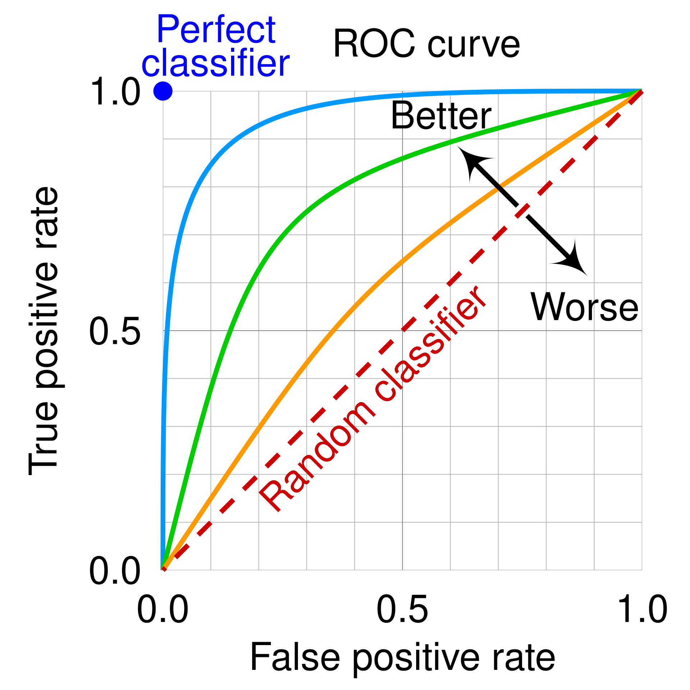
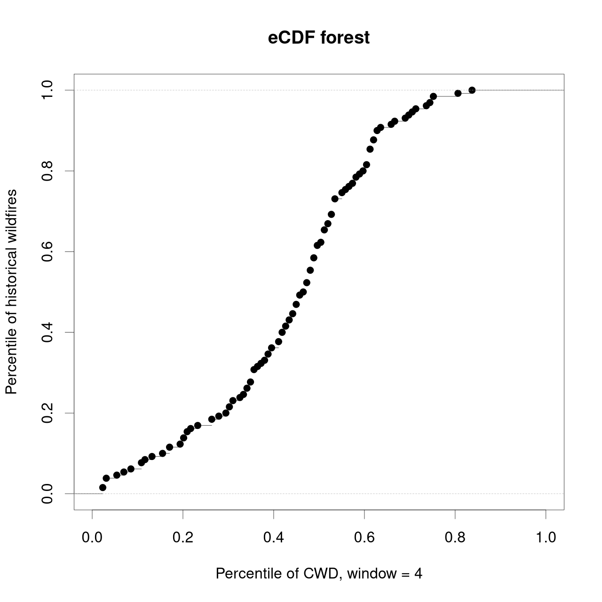

# Climatic Drivers of Wildfire Ignition Across CONUS Ecoregions

This repository contains the analysis code for a project that develops and evaluates a wildfire ignition danger rating system based on climatic water balance variables. The system is designed to be straightforward, computationally efficient, and applicable across different ecoregions in the conterminous United States (CONUS).

This work expands upon an analysis originally conducted for the Southern Rockies (Thoma et al., 2020) which was extended to the Middle Rockies as part the work for a Masters Thesis (Huysman et al., *in prep*) and is generalized here for all US L3 ecoregions.

## Project Goal

The primary goal is to identify the most effective climatic indicators and temporal scales for predicting wildfire ignition. This allows for the creation of a flexible, forecastable, and projectable fire danger rating system that can be used for both short-term management decisions and long-term conservation planning, such as identifying potential climate-resilient wildfire refugia.

## Methodology

The analysis follows a systematic approach for each Level III ecoregion in the CONUS:

1.  **Data Ingestion**: Historical wildfire ignition data is sourced from the Monitoring Trends in Burn Severity (MTBS) database. Climate and water balance time series (e.g., CWD, VPD, Temperature) are extracted for the centroid of each fire polygon from gridded datasets (gridMET, NPS Gridded Water Balance).

2.  **Indicator Calculation**: Rolling sums (for flux variables like CWD) or means (for state variables like VPD) are calculated over a range of window widths (e.g., 1 to 31 days) preceding each day in the time series.

3.  **Normalization**: To account for local climate variability, the rolling values are converted to a percentile rank. A custom percentile rank function (`my_percent_rank`) is used for zero-inflated variables to improve model sensitivity at low-to-moderate levels of dryness.

4.  **Classifier Evaluation**: The performance of each climate indicator and rolling window width as a binary classifier of ignition (fire vs. no-fire ignition on that day) is evaluated using Receiver Operating Characteristic (ROC) curves. The ROC curves represent the performance of a binary classifier (ignition or no ignition) by plotting the trade-off between true- and false-positive rates at varying thresholds of classification. The Area Under the Curve (AUC) and partial AUC (pAUC) are used to identify the optimal predictor, prioritizing performance under the driest conditions (high pAUC) because misclassification (false negative) of fire danger under the driest conditions has the potential to be more costly than misclassifications under wetter conditions where fires are likely to be less severe.

<figure>
    
    <figcaption>Receiver Operating Characteristic (ROC) curve showing true and false positive rates. Performance of a random classifier is shown by the diagonal line which is analogous to predicting ignition using a coin flip. Three example classifiers are shown in blue, green, and orange. The best possible classification performance is represented by the point in the upper left of the plot, which has 100% sensitivity (no false negatives) and 100% specificity (no false positives).

Image Source: cmglee, MartinThoma, <a href="https://creativecommons.org/licenses/by-sa/4.0">CC BY-SA 4.0</a>, via Wikimedia Commons</figcaption>
</figure>

5.  **Danger Rating System**: An empirical cumulative distribution function (eCDF) is generated for the best-performing indicator. This function maps a given dryness percentile to the historical proportion of wildfires that ignited at or below that level, creating a tunable, risk-based danger rating.

<figure>
    
    <figcaption>Example Empirical Cumulative Distribution Function (eCDF) for the forest cover type in the Middle Rockies ecoregion. The curve shows the relationship between the percentile of dryness (based on a 4-day rolling sum of Climatic Water Deficit) and the cumulative proportion of historical wildfires that ignited at or below that dryness level. This function is used to establish a tunable, risk-based danger rating. For example, a manager can identify the dryness percentile that corresponds to a specific proportion of historical fire ignitions (e.g., 10%) and use it as a threshold for management actions.</figcaption>
</figure>

The "quantile raster" generated by `save_quants_lyr.R` acts as a rapid, spatial lookup table for local climate normals and can be used to rapidly assess fire ignition danger on a given historical or future date using the eCDF function.

<figure>
    
    <figcaption>Wildfire ignition danger in Yellowstone National Park, Grand Teton National Park, and John D. Rockefeller, Jr. Memorial Parkway during a one-week period in June 1988, before the height of the Yellowstone fires. Wildfire ignition danger is calculated from 5-day (forest) and 3-day (non-forest) rolling means of daily vapor pressure deficit. Land cover data is retrieved from the LANDFIRE 2023 Existing Vegetation Type layer.</figcaption>
</figure>

# Forecasting Wildfire Ignition Danger

Beyond the retrospective analysis, the methodology is designed to be implemented as an operational, near-real-time forecasting system. This system generates daily maps of wildfire ignition danger for a given forecast period (e.g., the next 7 days). The process involves three main phases.

### 1. Daily Data Acquisition

The system relies on the automated daily retrieval of historical and forecast weather data from [gridMET](https://www.climatologylab.org/gridmet.html) and the [CFSv2 metdata daily forecasts](http://thredds.northwestknowledge.net:8080/thredds/catalog/NWCSC_INTEGRATED_SCENARIOS_ALL_CLIMATE/cfsv2_metdata_90day/catalog.html). The `update_rotate_vpd_forecasts.sh` script runs daily, repeatedly attempting to download the forecast to account for the data source updating at variable times. It uses a checksum comparison to detect when the source file has been updated, preventing the use of stale data. The script also rotates files to maintain a short history of recent forecasts, because forecast data for the current and previous days are not available on a given day either as CFSv2 forecasts or gridMET historical data.

### 2. Pre-computation of Climate Normals

To make daily forecasting computationally feasible, a one-time pre-computation step is performed (`save_quants_lyr.R`). Instead of re-analyzing the entire historical climate record (40+ years) for each forecast, the statistical distribution of the best-performing climate metric is pre-calculated for every pixel. The result is a multi-layer "quantile raster" where each layer represents a specific percentile (e.g., the 90th percentile) of the historical metric values for that location. This file acts as a rapid, spatial lookup table for local climate normals.

### 3. Daily Map Generation

The final forecast maps are generated through a daily process (`map_forecast_danger.R`):
1.  A seamless time series is created by combining recent historical climate data (e.g., last 40 days) with the newly acquired forecast data.
2.  The selected (i.e., best-performing) rolling metric (e.g., 5-day average VPD) is calculated for each day in the forecast period.
3.  For each pixel, its raw metric value is compared against its corresponding values in the pre-computed quantile raster to efficiently estimate its historical percentile rank.
4.  The eCDF model (from the retrospective analysis) is applied to this percentile raster, converting the dryness percentile into the final fire danger index (0–1).
5.  A vegetation map is used to create a final composite map, applying the appropriate model (e.g., forest vs. non-forest) to each pixel.

## Data Sources

*   **Wildfire Data**: [Monitoring Trends in Burn Severity (MTBS)](https://www.mtbs.gov/)
*   **Historical Climate Data**: [gridMET](https://www.climatologylab.org/gridmet.html)
*   **Forecast Climate Data**: [CFSv2 metdata daily forecasts](http://thredds.northwestknowledge.net:8080/thredds/catalog/NWCSC_INTEGRATED_SCENARIOS_ALL_CLIMATE/cfsv2_metdata_90day/catalog.html)
*   **Water Balance Data**: [NPS 1-km Gridded Water Balance Product](https://www.yellowstoneecology.com/research/Gridded_Water_Balance_Model_Version_2_User_Manual.pdf)
*   **Vegetation Data**: [LANDFIRE Existing Vegetation Type (EVT)](https://landfire.gov/evt.php)
*   **Ecoregions**: [EPA Level III Ecoregions of the Conterminous United States](https://www.epa.gov/eco-research/ecoregions-north-america)

## Code Structure

*   `src/03_dryness.R`: The core retrospective analysis script. It iterates through ecoregions and cover types, calculates rolling climate metrics, performs the ROC/AUC analysis, and saves the best predictors and eCDF models.
*   `src/update_rotate_vpd_forecasts.sh`: A shell script for the automated daily download of forecast data, featuring retry logic and file rotation.
*   `src/save_quants_lyr.R`: A script for the one-time pre-computation step that generates the quantile rasters from the long-term historical climate record.
*   `src/map_forecast_danger.R`: The operational script that combines recent historical data, new forecast data, the pre-computed quantile rasters, and the eCDF models to generate the final daily fire danger maps.
*   `data/`: Directory for input data sources like shapefiles and pre-processed climate data.
*   `out/`: Directory for all generated outputs, including plots, AUC results, and final eCDF models.
*   `assets/`: Directory for static files for README file.

## How to Run Retrospective Analysis

1.  Prepare the environment by installing the required R packages using renv: `renv::install()`
2.  Retrieve the required climate data. The analysis requires local copies of the required gridMET and NPSWB netCDF files. `00_download_gridmet.sh` can be used to retrieve CONUS grids for the required gridMET variables (requires approximately 57 GB of disk space). A similar script to download the CONUS grids for the NPS 1 km gridded water balance variables is not currently provided (TODO).
3. Retrieve the required LANDFIRE Existing Vegetation Type (EVT) layer. This file is too large (8.96 GB) to be stored with Git LFS and must be downloaded separately. EVT 2023 is used in the analysis as the most recent cover data for the entire CONUS available in LANDFIRE: https://landfire.gov/data-downloads/US_240/LF2023_EVC_240_CONUS.zip . Extract this file to `data/LF2023_EVT_240_CONUS`.
4.  Prepare the cover type (`01_extract_cover.R`) and climate data (`01_extract_gridmet.R` and `01_extract_npswb.R`) for each US L3 ecoregion.
5. Prepare a list of bad sites based on missing or erroneous data using `02_data_qc.R`.
6.  Ensure input data is correctly placed in the `data/` directory. The analysis expects pre-processed Parquet files of climate data linked to MTBS fire `Event_ID`s.
7.  Execute the main analysis script: `Rscript src/03_dryness.R`
8.  Results, including CSV files of AUC scores and the RDS files containing the eCDF objects for the best predictors for each ecoregion, will be saved in the `out/` directory.

## Acknowledgments
This work was supported by funding provided by the National Park Service through an agreement with the [Northern Rockies Conservation Cooperative](https://nrccooperative.org/)
